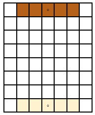
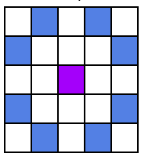
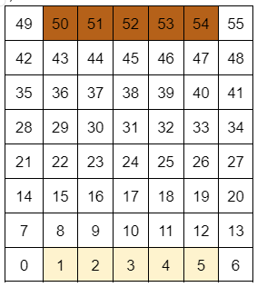

# Assignment 2: Search-Based Planning

In this assignment, you will implement a search-based planner to find a plan to go from a starting board configuration to a goal board configuration in the board game [End of the Track](https://www.gaya-game.com/products/the-end-of-the-track) using Python. See [Appendix A](#_kwwezta36kaz) for the Python environment setup. See [Appendix B](#_1rntv3t3lcin) for information on Pytest and our recommendations for testing your code. 

**End of the Track**

End of the Track is a 2-player board game played on a grid. The grid is 8x7 (8 rows, 7 columns). Each player controls 5 identically colored block pieces and 1 ball for a total of 12 pieces on the board. The goal of each player is to move their ball to the opposite side of the board before the opposing player does.




The initial configuration above is where each player’s pieces start, centered on opposite sides of the board, with each player’s ball placed on the center block of each player. Let “white” be the player controlling the pieces at the bottom of the board, and let “black” be the player controlling pieces at the top of the board. White moves first, then black, and they continue taking turns moving until one of them reaches their goal. The first player to move their ball to the opposite of the board is declared the winner.

The rules are simple. During a turn, the player moving may either  
(a) move a block piece, or  
(b) move (reposition) their ball piece,

after which the player’s turn ends. The board state at the beginning of and at the end of a given turn must differ. Thus, moving a ball around and back to the same position at the beginning of the turn is considered equivalent to not moving any pieces, which is equivalent to a player not taking their turn.

**_Block Piece Movements_**

The block pieces can only move like a knight in chess. In the diagram below, the purple square represents the current location of the block piece, and the blue squares represent valid moves for the piece.




It should be noted that a block can only move to unoccupied spaces on the board, and that a block can only be moved if it is not holding a ball.

**_Ball Piece Movements_**

A player’s ball can only be passed from the block piece holding it to a block piece of the same color along vertical, horizontal, or diagonal channels (same as a queen in chess). If an opposing player’s block piece would intercept the ball along the desired passing path between pieces b1 and b2, then the pass is not valid, and the ball cannot be moved from b1 to b2 directly. However, if there exists an unobstructed passing path from b1 to b3, and from b3 to b2, then the player could pass from b1 to b3 to b2 as a valid move. Therefore, in a single turn, a player may pass their ball between pieces of the same color an unlimited number of times as long as the passing channels for the ball are unobstructed on each pass.

## Part 0: State Validation

In order to ensure the algorithms you implement generate valid states and valid actions, and to help you test your implementations, you will first implement validation functions. There are 3 subparts to this part, highlighted in **_bolded italic_**.

We have provided a **class BoardState**, which provides a possible encoding / decoding mechanism for game board states. One natural representation of the board state is for each of the 12 pieces to be assigned a coordinate based on which column and which row it occupies: a piece position is (col, row). One possible way the coordinate representation can be encoded is into an integer representation, as shown in the below board.

**_Fill in the encoding and decoding functions_**, where the encoded state consists of integer representations, and the decoded state consists of (col, row) representations. We assume the lower left square on the board is (0,0), and the upper right square is (6,7). The encoding / decoding functions take in single positions. The encoding function takes in a tuple (col, row) and returns an integer. The decoding function takes in an integer and returns a tuple (col, row).




The following is the encoded representation of the initial configuration, where the first 6 elements of the array correspond with the white player’s pieces, and the second 6 elements of the array correspond with the black player’s pieces. The bolded underlined entries correspond with the current positions of the player’s balls. White’s ball is currently on the piece occupying position 3, and black’s ball is currently on the piece occupying position 52.

\[1,2,3,4,5,**3**,50,51,52,53,54,**52**\]

**_Next, given a board state, ensure that the board state_** is_valid. This means that out of all the possible numerical representations of the board state, all impossible states should return False, and all valid states should return True.

**_Finally, implement_** is_termination_state **_to determine if a board configuration state is a terminal state for either player (i.e. either player has won the game)._**

## Part 1: Action Enumeration and Validation

Next, you will need to enumerate the possible actions that a player can take from a given board configuration state. As a reminder, players can only move their own pieces. This part has 4 subparts, highlighted in **_bolded italic_.** For parts A and B, return a valid set of encoded positions the piece is allowed to move to for this turn.

A. **_Implement_** `Rules.single_piece_actions(board_state, piece_idx: int)`
   **_Enumerate a single block piece’s possible action._** Given a BoardState and a piece_idx that is an index into the encoded board_state.state, return the set of actions that piece can take. In this part of the problem, we are interested only in the block pieces, not the ball pieces, so assume that piece_idx will only ever refer to block pieces.
   
B. **_Implement_** `Rules.single_ball_actions(board_state, player_idx: int)`
   **_Enumerate a single ball piece’s possible actions._** This is similar to part (A), except we are interested in the possible actions that can be taken with the ball.
   
C. **_Implement_** `GameSimulator.generate_valid_actions(self, player_idx: int)`
   **_Enumerate all the valid actions for a player given a board configuration._** For this part, return the set of valid actions that the player can take. An action here is encoded as a tuple (relative_idx, position), as described in the code handout.
   
D. **_Implement_** `GameSimulator.validate_action(self, action: tuple, player_idx: int)`
   **_Action validation._** For this part, **return True only if the action is valid**; **otherwise you must raise a ValueError(“with a description about why this action is not valid”).**

## Part 2: Search

Implement your choice of search algorithm on the GameStateProblem. You will be given a starting board configuration, and a goal configuration. Your algorithm will output an optimal sequence of moves that go from the start to the goal. The solution your algorithm outputs must contain only valid states and valid actions.

You will need to implement your algorithm as a method of `GameStateProblem`. You will need to set your algorithm in **set_search_alg** for it to be used.

**Tips and Clarifications:**

- Search algorithms operate over a state space. The state space in this problem is the set of all possible BoardStates (essentially all the ways the pieces can be configured on the board). Your search algorithm accepts an initial state (some starting configuration), and specifies a goal state (some desired configuration). Your algorithm must find an **optimal solution** for going from the initial state to the goal state. The optimal solution is a sequence of state-action pairs with minimal length.
- Your algorithm is playing with both player’s pieces. This means, your algorithm will alternate between moving a white piece and a black piece. This means your state must keep track of which player’s turn it is, as this will allow you to determine the actions that can be taken from a particular BoardState.
- **Make sure to test your algorithm**. This means you should write deterministic test cases for your algorithm, and you should check whether your algorithm outputs the optimal solution. We recommend you start with testing 1-step and 2-step solutions before moving on to longer horizon solutions.
- If your search algorithm is taking a long time to solve short test cases, you should rethink your algorithmic approach and determine why it is taking so long (debug what is happening). When grading your algorithm, we will budget at 40 minutes for your algorithm to complete all test cases. An efficient implementation will solve all test cases well under this time limit. You will only receive credit for tests that complete successfully within the allotted time.

## Extra Credit

The assignment is worth 208 points in total. There are an additional 10 extra credit points. We test solutions of optimal length 2 through 7. Two of the longer solutions are worth 5 points each of extra credit.

#### **Code Handout (3 files):** `game.py, search.py, test_search.py` in this repository

# Submission Instructions
Please submit a zip file in Gradescope under AI388U-assignment2. Your zip file should include the following two files only:
1. `game.py`
2. `search.py`


### Appendix A

**_Python Details_**

- We will be running Python 3.10
- The only dependencies you’ll need are: numpy and pytest, we included requirements.txt specified such dependencies

We recommend using a virtual environment for these assignments. Instructions for creating a virtual environment with conda can be found here:

<https://docs.conda.io/en/latest/miniconda.html>

1. Create a new conda environment called `cs388u` that uses Python 3.10:
     ```bash
    conda create -n cs388u python=3.10
     ```
2. To activate the environment:
     ```bash 
     conda activate cs388u
     ```
3. Install the dependencies, numpy and pytest:
     ```bash
     conda install numpy pytest
     ```
4. To deactivate the environment:
     ```
     conda deactivate
     ```

### Appendix B

**Pytest**

We’ve included some test cases in the test_search.py file. To test your code against the included test cases, run pytest as follows:
```bash
conda activate cs388u
python -m pytest
```
You can also execute this command to run the tests before you implement the assignment - or parts of the assignment. It will just fail the tests corresponding to the parts that are not implemented. It will also print out some helpful information to help you debug what the issue is. For example, if you run the tests without implementing anything, you'll see a lot of lines with test failures such as:
```
FAILED test_search.py::TestSearch::test_game_state_goal_state - NotImplementedError: TODO: Implement this function
```
Note the `NotImplementedError`: It indicates that this piece of the assignment has not been implemented yet. As you start working on the assignment and run the tests, you may see different types of errors depending on what is missing or broken.

We highly recommend that you come up with more comprehensive test cases to test your implementations. Your test cases will be important for finding bugs in your implementations and identifying corner cases that you may have initially missed; see the comments in test_search.py. You can also take a look at the pytest documentation.

<https://docs.pytest.org/en/7.2.x/>
